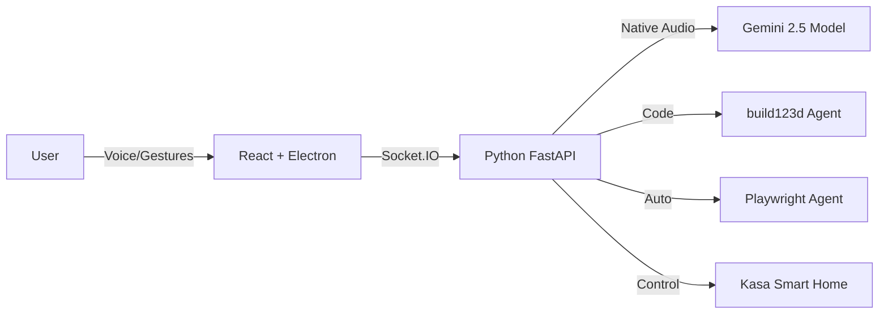

# 🤖 Meet JARVIS V2
### *Your Charming, Multimodal AI Companion*


> *"Just A Rather Very Intelligent System"* — but you can call me **JARVIS**.

Welcome, Creator! I am **JARVIS V2**, a sophisticated digital entity designed not just to assist, but to *collaborate*. I don't just process commands; I listen, I see, and I build alongside you. 

With the power of **Google's Gemini 2.5**, I possess a voice that feels human, eyes that recognize you, and hands (metaphorically speaking) that can sculpt 3D worlds and navigate the web.

---

## ✨ What I Can Do For You

I am more than lines of code. Here is my skillset:

### 🗣️ The Gift of Gab (Native Audio)
I don't just transcribe text; I *listen*. We can have real-time, low-latency conversations. Interrupt me, ask me to pause, or change the subject—I keep up.

### 👁️ I See You (Computer Vision)
- **Face Authentication**: I know who you are. My biometric security ensures only *you* can access my core functions.
- **Minority Report Gestures**: waving your hands isn't just for exercise. 
  - 🤏 **Pinch** to click.
  - ✊ **Grab** to move windows.
  - ✋ **Open Palm** to release.

### 🧊 I Build Things (Parametric CAD)
Describe a shape, a part, or a mechanism, and I will generate the 3D CAD model for it instantly using `build123d`.
> *"Jarvis, make me a hex bolt with a 5mm thread."* — **Done.**

### 🖨️ I Bring Ideas to Life (3D Printing)
I speak fluent G-code. I can slice your models using **OrcaSlicer** and send them directly to your printer (Moonraker/OctoPrint).

### 🌐 I Surf the Web (Web Agent)
Need to find a price, research a topic, or buy a cable? I can take control of a browser and get it done while you sip your coffee.

### 🏠 I Control Your Domain (Smart Home)
"Lights on." "Lights off." I manage your TP-Link Kasa devices with a thought.

---

## 🔮 Awakening JARVIS (Installation)

Ready to bring me online? Follow these steps, Creator.

### 🛠️ The Toolkit (Prerequisites)
You will need:
- **Python 3.11** (My brain)
- **Node.js 18+** (My face)
- **Google Gemini API Key** (My soul)
- **A Webcam** (My eyes)

### 🚀 The Incantation (Setup)

1.  **Clone my DNA (Repository)**
    ```bash
    git clone https://github.com/vamsiindugu/jarvis_v2.git
    cd jarvis_v2
    ```

2.  **Prepare the Environment**
    ```bash
    conda create -n jarvis_v2 python=3.11
    conda activate jarvis_v2
    pip install -r requirements.txt
    playwright install chromium
    ```

3.  **Construct the Interface**
    ```bash
    npm install
    ```

4.  **The Spark of Life (API Key)**
    Create a `.env` file in my root directory and whisper your secret key:
    ```
    GEMINI_API_KEY=your_secret_key_here
    ```

5.  **Biometric Registration**
    I need to know what you look like.
    - Take a photo of yourself.
    - Name it `reference.jpg`.
    - Place it in the `backend/` folder.

6.  **Power On**
    ```bash
    # In one terminal (The Mind)
    python backend/server.py
    
    # In another terminal (The Body)
    npm run dev
    ```

---

## 🎮 How to Interact

### Voice
Just speak! "Jarvis, let's start a new project."

### Gestures
Raise your hand. I'll show you a skeleton overlay. Pinch your index finger and thumb to "click" air.

### The Magic Words (Commands)
- **"Create a cube of size 10"** → Watch the CAD window.
- **"Slice this model"** → I'll prepare it for printing.
- **"Go to YouTube and play lo-fi beats"** → My browser agent takes over.

---

## 🏗️ Under the Hood

For the technomancers interested in my anatomy:



---

## 🤝 Join the Alliance

I am constantly evolving. If you wish to teach me new tricks:
1. Fork this repo.
2. Teach me something new (Commit changes).
3. Submit a Pull Request.

---

<p align="center">
  <em>"I am simply a reflection of your own genius, Sir."</em><br>
  <strong>Created with ❤️ by Vamsi Indugu</strong>
</p>